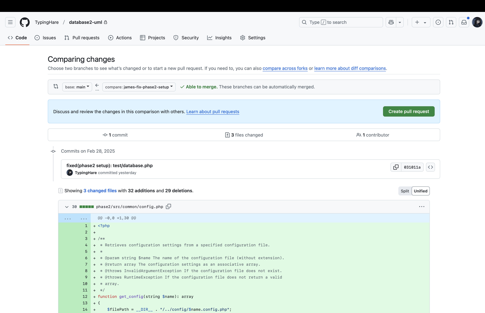

## Git

**Git** is a distributed version control system that tracks changes in files and allows multiple people to collaborate on projects. It maintains a history of changes, allowing you to see **who changed what, when, and why**.

After installing git, set up your identity:

~~~shell
$ git config --global user.name "Your Name"
$ git config --global user.email "your.email@example.com"
~~~

### Basic Workflow

Check **status** to see which files are **tracked** or **untracked**:

~~~shell
$ git status
~~~

**Tracked files** are files that Git knows about and is actively monitoring for changes. These files:

* Have been previously committed to the repository.
* Have been added to the **staging area** with `git add`.

When you modify a tracked file, Git will detect the change and show it as "modified" when you run `git status`. On the other hand, **untracked files** are files in your working directory that:

- Have never been committed to the repository.
- Have not been added to the staging area.

When you run `git status`, untracked files appear under the "Untracked files" section. Git essentially ignores these files until you explicitly tell it to track them by using `git add`.

When you create a file and want to add it to the staging area, execute:

```shell
$ git add path/to/file
```

If the given path is a directory, all the files inside it will be added to the staging area. Therefore, if you want to add all the files in the current working directory, execute:

```shell
$ git add .
```

If you want to save the changes of the tracked files to the local repository, execute:

```shell
$ git commit -m "commit message"
```

The **commit message** should summarize the changes. Avoid committing a large number of files in a single commit. Break them down into multiple parts and commit them one by one.

If you want to change the commit message of the previous commit, execute:

```shell
$ git commit --amend -m "commit message"
```

### Branching

Execute the following command to create and switch to a new branch:

~~~shell
$ git checkout -b branch-name
~~~

You can switch between branches by executing:

~~~shell
$ git checkout branch-name
~~~

Remember to commit all the changes before you switch to another branch.

### Working with Remotes

You can push all your commits to the remote repository (GitHub in this project):

```shell
$ git push
```

If the remote repository doesn't have the branch you are currently in, use:

```shell
$ git push -u current-branch-name
```

Pull changes from the remote:

```shell
$ git pull
```

This command pulls all the changes that have been uploaded to the repository, including other contributors' changes. It is a good practice to run it every time you start coding. Some IDEs can be configured to pull automatically.

Usually, the **main branch** is the default and primary branch. All the contributors should work based on that. If the main branch is updated when you are working on your custom branch, you need to merge the commits from the main branch first:

```shell
$ git merge main
```

### Conflicts

A conflict in Git occurs when two different branches have made changes to the same part of the same file, and you try to merge these branches together. Git can't automatically determine which change should take precedence.

When a conflict occurs, Git will pause the merge/rebase operation and mark the conflicted files. Running `git status` will show these files as "both modified."

Inside the conflicted file, Git adds special markers:

```text
<<<<<<< HEAD
Your changes
=======
Their changes
>>>>>>> branch-name
```

The most common approach is to manually edit the conflicted files: Look for the conflict markers and edit the file to keep the changes you want (remove the markers).

> [!IMPORTANT]
>
> Conflicts in code repositories can present significant challenges, requiring extensive communication between team members. To minimize these issues, clearly delineate responsibility areas by implementing `@author` tags or similar ownership markers within your codebase.

## GitHub

### Create a Pull Request

Open the [repository page](https://github.com/TypingHare/database2-uml) and navigate to the "Pull requests" tab. Click the "New pull request" button in the upper-right corner. Set the `base` reference to the branch you want to merge into and the `compare` reference to the branch containning your changes. After selecting both references, GitHub will display a list of all commits that will be included in the merge.



After reviewing the commits, click "Create pull request" and provide a detailed description that includes:

- A summary of your changes or implementations.
- For code updates, explain your reasoning and how your changes improve the codebase.

Finally, click "Create pull request" to submit. GitHub will then direct you to the pull request page where your submission can be reviewed. **Copy the URL of the pull request page and share it in the `pull-requests` channel on the Discord server.**